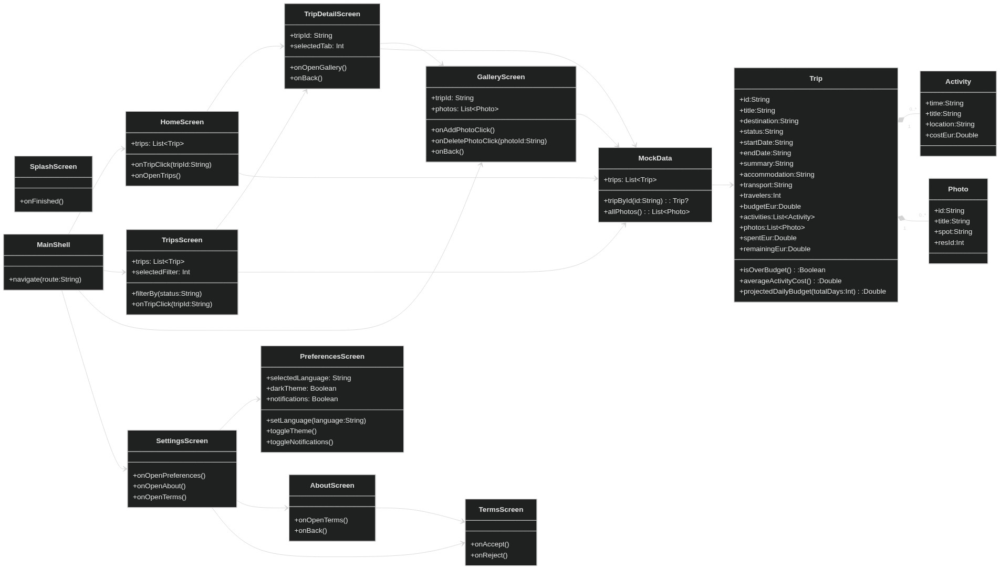

# BBTraveling - Sprint 01

Bienvenido a **BBTraveling**, una app Android de planificación de viajes creada para el Sprint 01 de la asignatura **Applications for Mobile Devices**.

El proyecto entrega una experiencia **mock completa**: navegación funcional, modelo de dominio, datos realistas hardcoded y diseño visual coherente con identidad morado/amarillo.

## Sobre el proyecto

BBTraveling nace para simplificar la organización de viajes de forma visual, clara y escalable.

En este sprint no hay backend ni persistencia: el objetivo es validar estructura, navegación y presentación de la aplicación.

## Funcionalidades implementadas (Sprint 01)

- Splash con logo, nombre de app, barra de carga y versión
- Home/Dashboard con “Next Trip” y métricas
- Trips con filtros y listado de viajes mock
- Trip Detail con tabs `Overview` / `Itinerary`
- Gallery global y por viaje (UI mock de añadir/eliminar)
- Settings + Preferences (idioma, tema y notificaciones en modo mock)
- About y Terms & Conditions
- Navegación completa con `NavController` (root + bottom navigation)

## Tecnologías usadas

- Kotlin
- Jetpack Compose (Material 3)
- Navigation Compose
- Gradle (Kotlin DSL)
- Android Studio

## Estructura del repositorio

```text
BBTraveling/
|- app/
|  |- src/main/java/com/example/bbtraveling/
|  |  |- data/
|  |  |- domain/
|  |  |- navigation/
|  |  \- ui/
|  |     |- screens/
|  |     \- theme/
|- docs/
|  |- app-flow.mmd
|  |- app-uml.mmd
|  |- diagrams/
|  |  \- app-uml.jpg
|  |- domain-model.mmd
|  |- design.md
|  |- color-palette.md
|  |- plan_sprint01.md
|  \- final_sprint01.md
|- README.md
|- CONTRIBUTING.md
\- LICENSE
```

## Diagrama UML de la app

El diagrama UML principal se mantiene en formato editable y en formato visual:

- Editable (Mermaid): `docs/app-uml.mmd`
- Visual (para README/release): `docs/diagrams/app-uml.jpg`



## Equipo

- Anouar El Kabiri
- Eloi Mora Palomino

## Estado del proyecto

- Sprint 01 completado
- Versión de entrega: `v1.0.0`

## Licencia

Proyecto académico para la asignatura **Applications for Mobile Devices**.
