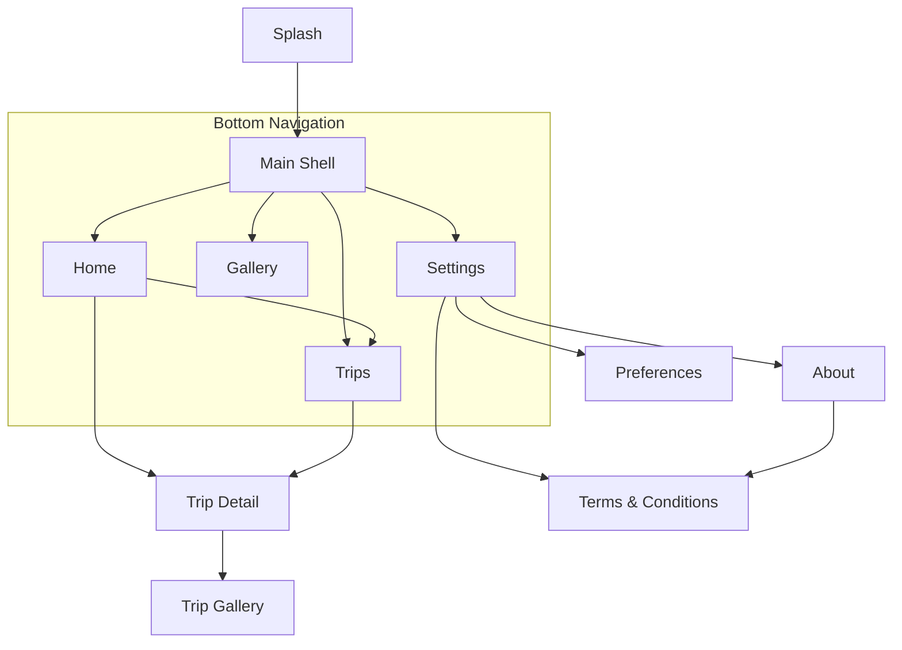
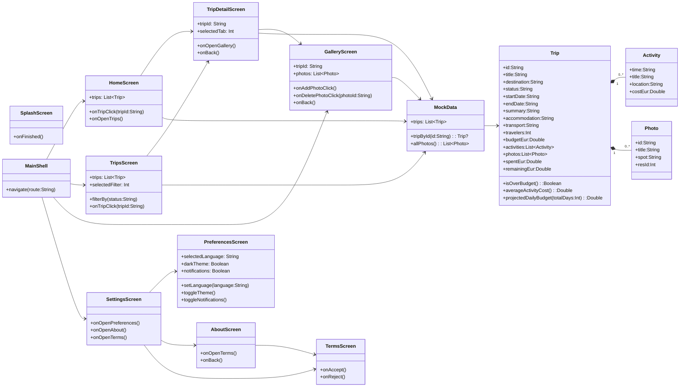

# Sprint 01 - Decisiones de diseno

## 1. Objetivo

Definir una base de app Travel Planner mock que sea:
- Clara en navegacion
- Coherente visualmente
- Modular por capas
- Escalable para Sprint 02

---

## 2. Arquitectura

Estructura usada en el proyecto:

- `ui/`: pantallas y componentes Compose
- `navigation/`: rutas y grafos
- `data/`: datos mock hardcoded
- `domain/`: entidades y funciones de negocio

Esta separacion permite evolucionar UI y datos sin acoplamiento fuerte.

---

## 3. Modelo de navegacion

### Root graph

- `Splash`
- `Main`
- `TripDetail/{tripId}`
- `Gallery/{tripId}`
- `Terms`

### Bottom navigation (`MainShell`)

- `Home`
- `Trips`
- `Gallery`
- `Settings`

### Flujo de pantallas (Mermaid)

---

## 4. Diagrama UML de app (pantallas + acciones)

Este diagrama extiende el flujo anterior con atributos y funciones principales.

---

## 5. Modelo de dominio

Entidades principales:

- `Trip`: agregado principal del viaje
- `Activity`: item de itinerario con coste
- `Photo`: item de galeria

Funciones de `Trip` en Sprint 01:

- `spentEur`
- `remainingEur`
- `isOverBudget()`
- `averageActivityCost()`
- `projectedDailyBudget(totalDays)`

El diagrama de dominio detallado se mantiene en `docs/domain-model.mmd`.

---

## 6. UI y tema

- Base visual Material 3
- Identidad morado/amarillo
- Tarjetas y jerarquia clara
- Preferencias con idioma mock: `English`, `Espanol`, `Catalan`

---

## 7. Actualizacion Sprint 02 (Logic)

Arquitectura implementada para el segundo sprint:

- `UI -> ViewModel -> Repository -> DataSource`
- `FakeTripDataSource` como almacenamiento in-memory
- `TripRepository` + `TripRepositoryImpl` para CRUD de viajes y actividades
- `SharedPreferencesSettingsRepository` para persistir ajustes de usuario

Se anadieron validaciones funcionales para:

- campos obligatorios
- fechas de viaje (inicio < fin y futuras)
- fechas de actividad dentro del rango del viaje

Ademas:

- Se aplico soporte multiidioma real (`en`, `es`, `ca`) con recursos por locale
- Se añadieron logs de operaciones y errores de validacion para Logcat
- Se incorporaron pruebas unitarias de CRUD y validaciones base
